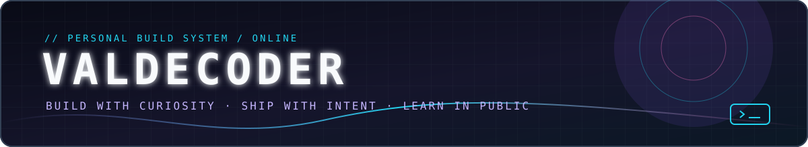
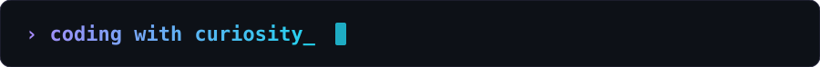
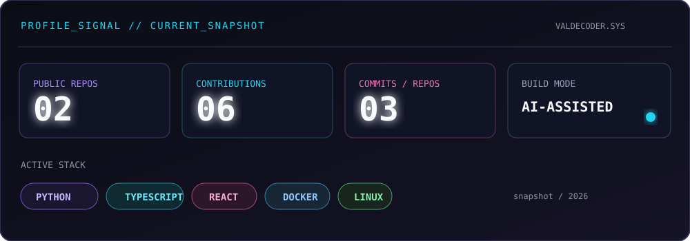
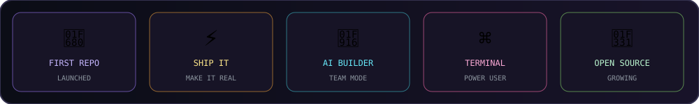
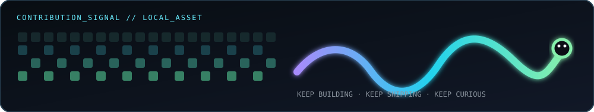
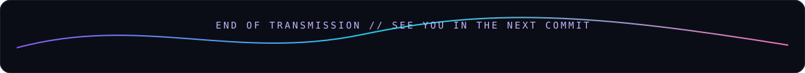

<h1 align="center">Hi there, I'm ValdeCoder 👋</h1>

  
  
  

---

### 🚀 About me

- 🔭 Exploring the intersection of **code + AI agents**
- 🌱 Learning something new **every single day**
- ⚡ Fun fact: **my repos are built with help from AI teammates**

---

### 🛠️ Tech Stack

---

### 📊 GitHub Stats

---

### 🏆 Achievements

---

### 🐍 Contribution signal

---

